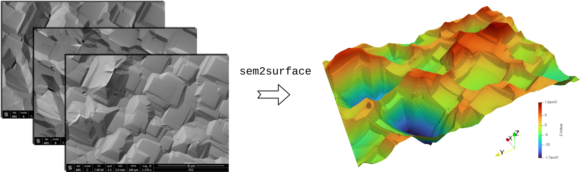
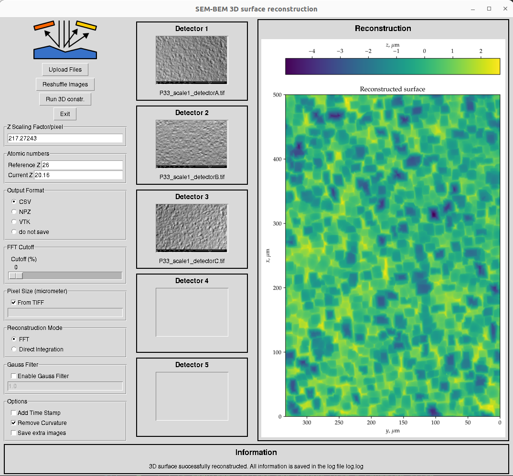

# `sem2surface` a Tool for 3D Surface Reconstruction from Multi-Detector SEM/BSE Images 

**`sem2surface`** &nbsp; 

## Overview

This repository contains a Python-based solution for 3D surface reconstruction from SEM/BSE images captured using a minimum of three detectors. The methodology leverages the Principal Component Analysis (PCA) of the captured images to discern the principal component images [1]. To reorient gradient images along $x$ and $y$ axes, the Radon transform is used. The final 3D surface, represented as \(z(x,y)\), is derived from its gradients either through the Frankot and Chellappa method [2] (this is the reference method providing the best results) or via direct integration paired with a minimization process between adjacent profiles. 



For qualitative results, any scaling factor for the vertical axis can be applied to the final surface. However, to get the quantitative results, the scaling factor has to be provided.
The simplest way to find the scaling factor is to use the Vickers hardness test's imprint as a reference surface for the given SEM and given material. The `fit_Vickers_indenter.py` module enables to find the scaling factor from the Vickers hardness test's imprint.

## Features

- **Intuitive GUI**: A user-friendly simplistic interface built with Python's Tkinter allows for easy image uploads and 3D surface construction.
- **Comprehensive Outputs**: Each execution yields:
  - 3 original images and their PCA decomposition (PNG format).
  - Radon transform RMS change wrt the rotation angle (PDF format).
  - Gradients visualisation along $x$ and $y$ (PNG format).
  - 3D map of the reconstructed surface (2 PNG files).
  - ASCII representation of the reconstructed surface with \(x,y,z\) columns.
  - Surface roughness data (CVS,VTK or NPZ format).
  - Detailed log file capturing all operations (TXT format).

## Getting Started

Check that all required packages are installed:
```bash
pip install -r requirements.txt
```
To launch the interface, execute the following command:
```bash
python sem2surface_gui.py
```
To run without GUI, use the following command (do not forget to provide your own images directly in the script):
```bash
python test_without_gui.py
```
A user has to upload at least three SEM images (supported formats: JPG, PNG, TIFF, BMP) and initiate the reconstruction process by clicking the "3D Reconstruct" button.

## Graphical User Interface



The interface is built with Python's Tkinter. The following functions/options are available:

**Functions:**
+ **Upload Images** - upload at least three SEM images (supported formats: JPG, PNG, TIFF, BMP).
+ **Reshuffle Images** - reshuffle the uploaded images.
+ **Run 3D constr.** - initiate the reconstruction process.
+ **Exit** - close the interface.

**Options:**
- **Z Scaling Factor**: The scaling factor for the vertical axis (to be defined, e.g. through the Vickers hardness test's imprint)
- **Output Format**: The format of the output file (CSV, VTK, NPZ) or "do not save"
- **FFT Cutoff**: The cutoff frequency for the FFT reconstruction in percentage of the Nyquist frequency
- **Pixel Size**: If the pixel size if provided in SEM-generated TIFF files, check the checkbox "From TIFF", otherwise provide the pixel size in m/pixel.
- **Reconstruction Mode**: FFT (preferable) or direct integration
- **Gauss Filter**: If True, a Gaussian filter is applied to the original images, `sigma` - the standard deviation of the Gaussian filter
- **Add time stamp**: If checked, the time stamp is added to the output file name
- **Remove Curvature**: If checked, the curvature is removed from the final surface, this is an important step for both qualitative and quantitative analysis.
- **Save extra images**: If checked, several intermediate images are saved (PCA decomposition, Radon transform RMS change wrt the rotation angle, gradients visualisation along $x$ and $y$).

## Repository Structure

- `src/`
  - `sem2surface.py`: Core module for 3D surface reconstruction from SEM/BSE images.
  - `sem2surface_gui.py`: GUI module.
  - `fit_Vickers_indenter.py`: Module to find scaling factor from Vickers hardness test's imprint.
  - `test_without_gui.py`: Example of the script without GUI.
  - `logo.png`, `logo.svg`: Application logo.
- `doc/`
  - `sem2surface.pdf`: Concise documentation.
  - other source files for the documentation.
- `examples/`
  - `Surface_1/`: Example of the script without GUI.
  - `Surface_2/`: Example of the script without GUI.
  - `Vickers_imprint/`: Example of the script without GUI.
- `requirements.txt`: List of required packages.
- `README.md`: This file.

## References

+ [1] Neggers, J., Héripré, E., Bonnet, M., Boivin, D., Tanguy, A., Hallais, S., Gaslain, F., Rouesne, E. and Roux, S. (2021). Principal image decomposition for multi-detector backscatter electron topography reconstruction. *Ultramicroscopy*, 227:113200. [DOI](https://doi.org/10.1016/j.ultramic.2020.113200)
+ [2] Frankot, R. T., & Chellappa, R. (1988). A method for enforcing integrability in shape from shading algorithms. *IEEE Transactions on Pattern Analysis and Machine Intelligence*, 10(4):439-451. [DOI](https://doi.org/10.1109/34.3909)

## Additional Information

- **Developer**: Vladislav A. Yastrebov
  - Affiliation: CNRS, Mines Paris - PSL, Centre des matériaux, Evry/Paris, France
  - Date: Aug 2023 - Dec 2024
  - [yastrebov.fr](https://yastrebov.fr)
- **Licence**: BSD 3-Clause License.

## Examples


## Releases

+ [v0.1.0](https://github.com/vyastreb/sem2surface/releases/tag/v0.1.0) - Initial release (Dec 12, 2024)

## Acknowledgements

All SEM measurements were obtained by Fabrice Gaslain [(ORCID)](https://orcid.org/0000-0001-5187-1613), CNRS, Mines Paris -PSL, Centre des matériaux, Evry/Paris, France.

The code was developed with the assistance of GPT-4, CoderPad plugin, Copilot in VSCode and Claude 3.5 Sonnet in Cursor.

