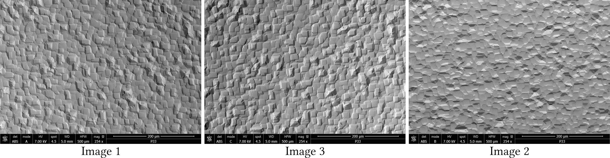
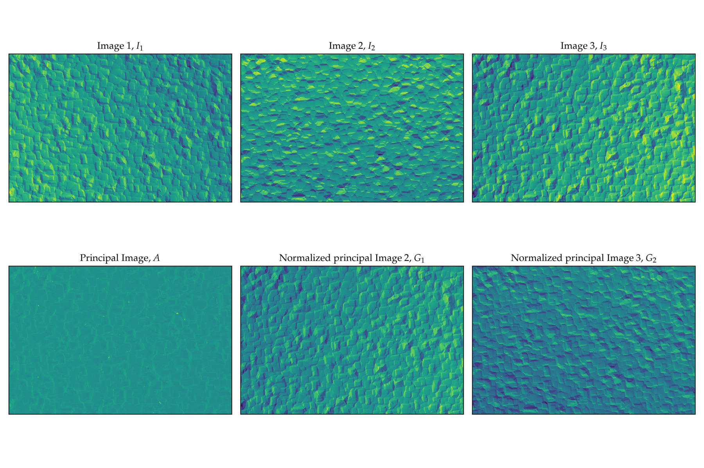
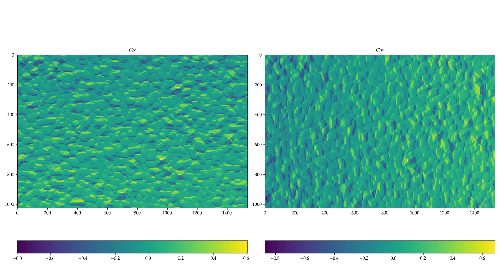
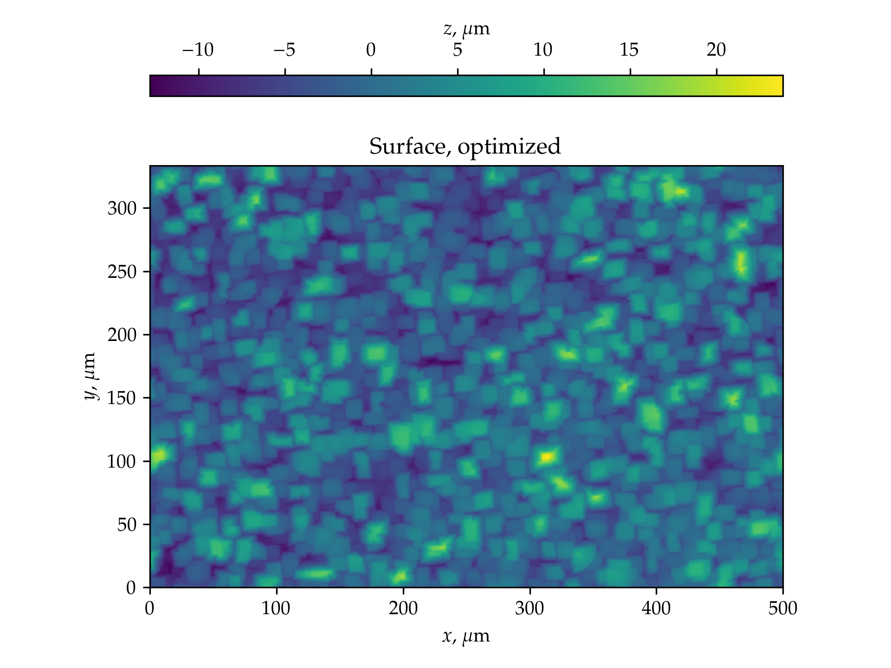
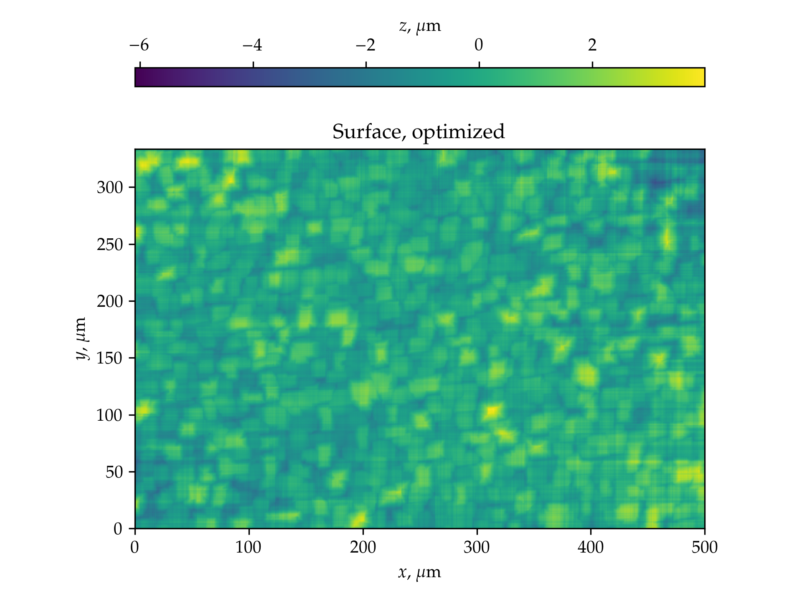

**License:** [Creative Commons Attribution 4.0 International License](https://creativecommons.org/licenses/by/4.0/)

## 1. Overview

This script reconstructs 3D surfaces from SEM images obtained from at least 3 BSE detectors without prior knowledge of their orientation. The reconstruction is based on SVD decomposition, x and y gradient components are obtained using Radon transform, the full surface is reconstructed either by direct gradient integration or, preferably, by an FFT-based method by [@frankot]. The whole strategy is based on the method described in [@neggers]. 

## 2. Method

Below we list the main steps of the method:

1. Load images $I_i, i\in[1,N]$ with $N\ge3$ (see [@fig:original_image])

    + It is supposed that the SEM image has information block (FOV, magnification, etc.) in the bottom side of the image. This block is automatically trimmed. If it is not the case, the user can manually trim the image.
    + Image names with the full path is stored in the log file.
    + If requested, a Gaussian filter is applied to the images.

{#fig:original_image}

2. A correlation matrix $C_{ij}$ is constructed from the images $I_i$ with components $C_{ij} = \sum_{x,y} I_i(x,y)I_j(x,y)$.

3. A Singular Value Decomposition (SVD) of the correlation matrix is performed: $C_{ij} = \sum_{k=1}^N U_{ik}S_kV_{jk}$.

4. The first three columns of the matrix $U$ are used to construct the intensity image and two components of the gradient (along unknown principal directions) as follows (see [@fig:decomposition]):

    + Intensity: $A = \sum_i U_{i1} I_i$.
    + Gradient 1: $G_1 = \sum_i  U_{i2} I_i / A$    
    + Gradient 2: $G_2 = \sum_i U_{i3} I_i / A$

{#fig:decomposition}

5. The $x$ and $y$ components of the gradient are obtained by using Radon transform of the gradient images $G_1$ and $G_2$. Specifically, we keep only the circular region of $G_1$ and null all data around (requirements of the Radon transfom module). Then we compute Radon transform $R(\theta)$ and compute its RMS for every value of $\theta$ (see [@fig:radon_transform]). Since Radon transform is computationally intensive, we apply it on $G_1$ only and discretize probe $\theta\in[0,\pi]$ in 180 points. The angle $\theta_1$ corresponding to the minimum RMS is the angle of the first principal direction $\theta_1$ (see [@fig:radon_transform]).
The second principal direction $\theta_2$ is perpendicular to the first one. It could be evaluated in the same manner using $G_2$. 

{#fig:radon_transform}

6. The $x$ and $y$ components of the gradient are then obtained as follows:

    + $G_x = G_1 \cos(\theta_1) + G_2 \cos(\theta_2)$
    + $G_y = G_1 \sin(\theta_1) + G_2 \sin(\theta_2)$

In addition, a macroscopic tilt is substracted from these gradients (see [@fig:gradients]). The tilt is computed as the average of the gradients over the whole image.

+ $G_x = G_x - \langle G_x \rangle$
+ $G_y = G_y - \langle G_y \rangle$

where $\langle G_x \rangle$ and $\langle G_y \rangle$ are the average values of the gradients $G_x$ and $G_y$.

{#fig:gradients}

7. To reconstruct the surface from the gradients $G_x = \partial z/\partial x$ and $G_y = \partial z/\partial y$, we use a method based on Fourier transform, see [@frankot]. The Frankot & Chellappa method, providing very high reconstruction quality (see [@fig:surface_fft]), is based on the following Fourier transform pair:
    + $\partial^2 z/\partial x^2 \leftrightarrow -k_x^2 \hat z(k_x,k_y)$
    + $\partial^2 z/\partial y^2 \leftrightarrow -k_y^2 \hat z(k_x,k_y)$
where $\hat z(k_x,k_y)$ is the Fourier transform of the surface $z(x,y)$ and $k_x,k_y$ are the wave numbers. 
The surface is then reconstructed as follows:
    + $\hat z(k_x,k_y) = -\frac{1}{k_x^2+k_y^2} \left( k_x \hat G_x(k_x,k_y) + k_y \hat G_y(k_x,k_y) \right)$
    + $z(x,y) = \mathcal{F}^{-1}\left\{ \hat z(k_x,k_y) \right\}$
where $\mathcal{F}^{-1}$ is the inverse Fourier transform and $\hat G_x(k_x,k_y)$ and $\hat G_y(k_x,k_y)$ are the Fourier transforms of the gradients $G_x$ and $G_y$.

If one wants to reconstruct only main features of the roughness and ignore or smooth out small scale roughness and noise, then a cut-off frequency can be introduced, in the GUI it is called `FFT cutoff` and provides the maximal wave number $k_{\max}$ (in percentage of Niquest frequency) beyond which the Fourier components are set to zero.

**Caution:** my attempts to remove the curvature directly in the FFT space were not successful. The curvature is removed in the final step.

{#fig:surface_fft}

7.b. An alternative method is a direct integration along $x$ and $y$ direction followed by minimizing distance between adjacent profiles and averaging between profiles integrated along $x$ and $y$. In general, this method provides results of much lower quality, and is based on the following relations:
    + Assume that the first profile along $y$ is zero $z^{1,j}_x = 0$ for $j\in[1,N_y]$.
    + Integrate the first profile along $x$ direction $z^{i+1,1}_x = z^{i,1}_x + G_x^{i,1} \Delta x$ for $i\in[1,N_x-1]$, where $\Delta x$ is the pixel size.
    + Integrate next profile along $x$ direction $\tilde z^{i+1,j}_x = z^{i,j}_x + G_x^{i,j} \Delta x$ for $i\in[1,N_x-1]$ and $j\in[2,N_y]$ and remove the average difference with respect to the previous provile $z^{i+1,j}_x = \tilde z^{i+1,j}_x - \langle \tilde z^{i+1,j}_x - z^{i+1,j-1}_x \rangle$.
    + Repeat the previous step for all profiles along $y$ direction using $G_y$ to get $z^{i,j}_y$.
    + Remove the average value of $z^{i,j}_x$ and $z^{i,j}_y$, i.e. $z^{i,j}_x = z^{i,j}_x - \langle z^{i,j}_x \rangle$ and $z^{i,j}_y = z^{i,j}_y - \langle z^{i,j}_y \rangle$.
    + Construct the final surface as $z(x,y) = \frac{1}{2} \left( z^{i,j}_x + z^{i,j}_y \right)$.

{#fig:surface}

8. The final step is the removal of the curvature of the surface. This is done by fitting a parabolic surface in principal axes 
$$z(x,y) = \frac{x^2}{R_x^2} + \frac{y^2}{R_y^2} + z_0$$ 
and substracting it from the surface. The curvatures $R_x,R_y$  and the off-set $z_0$ are obtained by the least square fitting procedure.

## References

